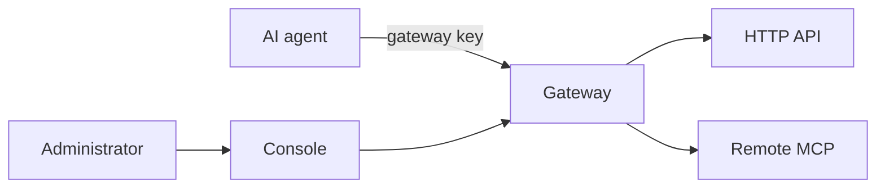

# Asterlane

English | [简体中文](README.zh-CN.md)

[](https://github.com/komiyoo/asterlane/actions/workflows/ci.yml)
[](LICENSE)
[](https://www.rust-lang.org)

Once an agent connects to more than a few MCP servers and HTTP APIs, authentication, client configuration, permissions, and context all start to sprawl. Asterlane pulls them into one gateway. Model calls do not go through it.

> [!NOTE]
> Asterlane is in early development (`0.1.0`, no tagged release yet). Configuration fields, the admin API, and CLI output may still change between commits. Breaking changes are recorded in [CHANGELOG.md](CHANGELOG.md).

## Features

- **Credentials stay in the gateway.** Upstream API keys and OAuth tokens are resolved from env vars, files, Vault, or Infisical and injected at call time. Agents only hold a gateway key.
- **One endpoint for every client.** Remote MCP servers (Streamable HTTP) and HTTP APIs are exposed through a single MCP endpoint at `/mcp`.
- **Per-key tool scopes.** Allow and deny rules are regular expressions over stable tool names; deny wins, and a request can only narrow its scope.
- **Small context by default.** `tools/list` returns six gateway tools; agents search, describe, and call only what the task needs. Oversized results are truncated and fetched in chunks.
- **HTTP APIs as tools.** Declare endpoints in YAML or discover them from an OpenAPI document.
- **Upstream OAuth.** The gateway acts as the OAuth client for remote MCP servers (client credentials or authorization code), and stores tokens encrypted.
- **Limits and key pools.** Per-key rate limits and call quotas, per-upstream rate and concurrency limits; multiple upstream keys per resource with rotation, cooldown, and retries for idempotent requests.
- **Visibility.** Every call is recorded with key, tool, outcome, and latency in SQLite. Prometheus metrics at `/metrics`, plus an admin console and CLI.

## Quick start

Requires Rust 1.94 or newer and `jq`. This uses the example config in [`examples/gateway.yaml`](examples/gateway.yaml); replace the placeholders with your own values. Without a valid Exa key the gateway still starts, but the real search call fails.

Terminal 1, start the gateway on `127.0.0.1:3000` with an in-memory database:

```bash
export ASTERLANE_CONFIG=examples/gateway.yaml
export ASTERLANE_ADMIN_TOKEN=replace-me-admin-token
export EXA_DEFAULT=replace-me-exa-api-key
cargo run -- serve --database-url sqlite::memory:
```

Terminal 2, preview what the key `agent-search-research` can see, issue a gateway token for it, and call a tool:

```bash
export ASTERLANE_CONFIG=examples/gateway.yaml
export ASTERLANE_ADMIN_TOKEN=replace-me-admin-token

cargo run -- list-tools --key agent-search-research

export ASTERLANE_KEY="$(
  cargo run --quiet -- admin proxy-keys issue agent-search-research --format json |
    jq -r '.token'
)"
cargo run -- tools call search__exa__neural_search --args '{"query":"rust mcp"}'
```

Point your agent at `http://127.0.0.1:3000/mcp` as an MCP server, with the gateway token as its credential. More options are in [Running the Gateway](docs/admin/running.md).

## Installation

**From source**

```bash
git clone https://github.com/komiyoo/asterlane.git
cd asterlane
cargo install --path . --locked
asterlane --help
```

**Docker Compose (gateway + admin console)**

Edit `run.yaml`, then at the repository root:

```bash
export ASTERLANE_ADMIN_TOKEN=replace-me-admin-token
docker compose up -d --build
```

The gateway listens on `127.0.0.1:3721` and the console on `127.0.0.1:3722`. Log in to the console with the admin token. Production setup is described in [Deployment](docs/admin/deployment.md).

**Prebuilt binaries and images**

Each tagged release will publish binaries for `x86_64-unknown-linux-gnu`, `aarch64-unknown-linux-gnu`, and `aarch64-apple-darwin` on [GitHub Releases](https://github.com/komiyoo/asterlane/releases), and a multi-arch image at `ghcr.io/komiyoo/asterlane`. No release has been tagged yet.

## Admin console


The console manages resources, MCP servers, gateway keys, key pools, usage, events, and audit logs. Its interface is currently in Chinese.

## Why Asterlane

### Separate authentication for every upstream

Each upstream brings its own secret: an API key, a request header, or an OAuth token that the gateway has to exchange and refresh. If those secrets live in every agent's configuration, one rotation means editing every client, and the secrets leave the administrator's control.

```text
Before, each client stores its own:
  exa    ← API key
  tavily ← API key
  github ← OAuth token

Now, a client stores one gateway key.
The gateway keeps the upstream credentials and injects them at call time;
the agent never sees them.
```

HTTP APIs take the same path: the gateway wraps them as tools according to its configuration, and the agent still connects only to the gateway.

### Every client is configured separately

Each new upstream means entering its address and credentials in every client again. A client should only need to know one entry point: the gateway.

```text
Before:
  Client A → Exa, Tavily, internal API, remote MCP
  Client B → the same setup, again

Now:
  Client A → gateway
  Client B → gateway
  Upstream addresses and credentials live only in the gateway config
```

### Permissions are scattered

If which agent may use which tool is written into the clients, nobody can see it clearly or revoke it. The gateway scopes access per gateway key: allow rules grant, and deny rules take precedence. A filter inside a single request can only narrow that scope further; it can never reveal tools outside it.

```text
key "research":
  allow ^search__ and ^reader__
  deny  ^search__internal__

research calls search__exa__neural_search  → allowed
research calls search__internal__lookup    → denied
research asks for "only exa"               → can narrow, never widen
```

Replace or revoke the key and that agent's scope goes with it. Call records stay in the gateway: which key, which tool, whether it succeeded, and how long it took.

### Large tool catalogs fill the context

When a client connects, it usually puts every tool from `tools/list`, parameter schemas included, into the model context. With enough upstreams and HTTP APIs, the catalog fills the context before the task even starts. A single oversized result can also crowd out later turns.

By default, Asterlane keeps the catalog out of the list. `tools/list` returns only six fixed gateway tools, no matter how large the catalog is:

```text
tools/list
→ asl__status    how many tools this key can see
→ asl__search    search by task; short summaries first
→ asl__describe  full parameters for the chosen names only
→ asl__call      call one tool
→ asl__batch     up to 10 independent calls; results follow input order,
                 failures do not roll back
→ asl__fetch     continue a truncated long result
```

A task only pulls in the tool definitions it uses. Search omits full schemas by default; each hit carries a capped description and a top-level parameter signature. Details can be fetched for up to 10 tools at a time. Their schemas are stripped of boilerplate, while types, required fields, and constraints remain.

```text
asl__search { query: "web search", limit: 5 }
→ {
    tools: [
      { name: "search__exa__neural_search",
        description: "Search the web with Exa.",
        signature: "query: string",
        parameters: ["query"], required: ["query"] }
    ],
    next_cursor
  }

asl__describe { names: ["search__exa__neural_search"] }
→ { results: [ { tool: { name, description, input_schema } } ] }

asl__call {
    name: "search__exa__neural_search",
    arguments: { query: "rust mcp" }
  }
→ upstream result
```

Names outside the scope cannot be found by search, and calling them directly is rejected. A shorter list does not widen permissions.

A tool's stable full name is `domain__provider__tool`, three segments joined by `__`. `search__exa__neural_search` means the search domain, the exa provider, and the tool `neural_search`. Configuration, permissions, and call records all use this full name. If you already know the full name, pass it to `asl__call` or `tools/call` and skip the search.

The provider is the middle segment. To list every exa tool, match that segment with a regex, or match the whole full name:

```text
provider_regex: ^exa$
include: ^[a-z0-9_]+__exa__
```

`^search__` lists the whole search domain. These filters match on names, and results come back in full-name order. Clients pass them as `tools/list` filter parameters, and they apply to the catalog only when the key is configured with `discovery_mode: full`. Under the default lazy mode, `tools/list` still returns only the six gateway tools above.

When you don't know the name yet, use the `query` of `asl__search`. It scores against full names and descriptions: an exact full-name match ranks first, then full names starting with the text, then names containing it, then descriptions containing it. Tools matching the prefix come first; tools where the same text appears elsewhere in the name or in the description are also included, ranked lower. When the gateway also has semantic search configured, non-empty queries are ranked by similarity instead. An empty query still lists the tools visible to this key in full-name order.

The `name` in search results is always the three-segment full name. With `discovery_mode: full`, `tools/list` returns the shortest name under the current key that still resolves to exactly this tool, sometimes `neural_search` or `exa__neural_search`. Use the full name from search when calling.

Once a full name is exposed, it does not change. Segments, aliases, and filter fields are described in [Naming Convention](docs/architecture/naming-convention.md) (Chinese).

When a result exceeds that upstream's byte budget, the gateway returns the first chunk and a cursor, keeps the full content, and lets you page through the rest with `asl__fetch`:

```text
call → first chunk of text
       [Result truncated. Total 200000 bytes.
        Use asl__fetch with cursor "…" to get more.]

asl__fetch { cursor: "…", offset: <bytes already given to the model> }
→ next chunk; if more remains, the response gives the next offset
```

## Architecture

Administrators configure upstreams and each key's scope through the console. Agents enter the gateway carrying only a gateway key. The gateway then reaches upstreams with the credentials it stores.



## How it works

1. The administrator registers upstreams in the gateway, along with the scope each gateway key may use. Upstream secrets stay in the gateway.
2. An agent connects to the gateway with its one key and sees a subset of tools for the current task.
3. On a call, the gateway picks upstream credentials within that scope, applies limits, calls the matching MCP server or HTTP API, and returns the result to the agent.
4. Call records stay in the gateway, so administrators can review them and revoke access.

Configuration, permissions, and deployment are in the [docs](docs/README.md). The docs are currently written in Chinese.

## How it compares

| | Agents connect to each upstream directly | Agents connect through Asterlane |
| --- | --- | --- |
| Where upstream credentials live | In every client's config | Only in the gateway |
| Adding an upstream | Edit every client | Edit the gateway config once |
| Who decides tool access | Each client | The gateway, per gateway key, revocable |
| What the agent sees at connect time | Every tool of every server | Six gateway tools; the rest on demand |
| Call records | Scattered across clients and upstreams | One place, per key and tool |

## Non-goals

- **Not a model gateway.** Asterlane does not proxy, route, or bill LLM inference.
- **No local stdio MCP servers.** Upstream MCP servers are remote, over Streamable HTTP. The gateway does not spawn local processes.
- **Not an identity provider.** Agents authenticate with gateway keys; the gateway is not an OAuth authorization server and does not log in end users through SSO.

## Roadmap

Current gaps and priorities are in the [Roadmap](docs/product/roadmap.md). User-visible changes are listed in the [Changelog](CHANGELOG.md).

## Documentation

- [Docs map](docs/README.md)
- [Running the gateway](docs/admin/running.md)
- [Deployment](docs/admin/deployment.md)
- [Contributing](CONTRIBUTING.md)
- [Security policy](SECURITY.md)
- [Code of conduct](CODE_OF_CONDUCT.md)
- [Changelog](CHANGELOG.md)

## Acknowledgements

Asterlane is built on [rmcp](https://github.com/modelcontextprotocol/rust-sdk) (the official Rust MCP SDK), [axum](https://github.com/tokio-rs/axum), [reqwest](https://github.com/seanmonstar/reqwest), [sqlx](https://github.com/launchbadge/sqlx), [governor](https://github.com/boinkor-net/governor), and [Tokio](https://tokio.rs). The admin console uses [React](https://react.dev) and Cloudflare's [Kumo](https://www.npmjs.com/package/@cloudflare/kumo) components.

## License

[MIT](LICENSE)
