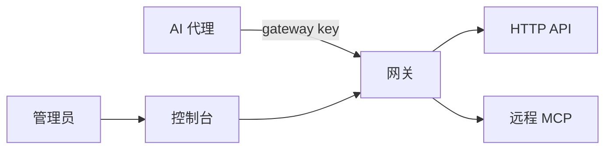

# Asterlane / 星径

[](https://github.com/komiyoo/asterlane/actions/workflows/ci.yml)

面向代理的第三方资源访问网关。上游 API 和远程 MCP 的凭据留在网关里；代理只拿到有范围的 gateway key，以及按当前任务收窄后的工具。模型转发不经过这里。

## 架构

管理员通过控制台或管理 API 配置上游、范围和限额。代理只连接网关。网关代持凭据，再去访问 HTTP API 或远程 MCP。



## 运行机制

1. 管理员把上游和每个 gateway key 能使用的范围配在网关里。上游密钥不下发给代理。
2. 代理用 gateway key 连接网关，按当前任务看到一部分工具，而不是整份目录。
3. 调用时，网关在范围内选定上游凭据，经过限额后访问对应的 HTTP API 或远程 MCP，再把结果交回代理。
4. 调用记录留在网关。管理员从控制台或 `asterlane admin` 查看。

配置字段、工具名、错误码和部署方式见 [文档](docs/README.md)。

## 运行

下面使用仓库里的 `examples/gateway.yaml`。把占位符换成你自己的值。`secret://exa/default` 对应环境变量 `EXA_DEFAULT`；没有有效的 Exa key 时，网关可以启动，真实搜索调用会失败。签发 token 的那一步需要 `jq`。

终端 1：启动网关。默认监听 `127.0.0.1:3000`，数据库只在内存里。

```bash
export ASTERLANE_CONFIG=examples/gateway.yaml
export ASTERLANE_ADMIN_TOKEN=replace-me-admin-token
export EXA_DEFAULT=replace-me-exa-api-key
cargo run -- serve --database-url sqlite::memory:
```

终端 2：用示例里的 key `agent-search-research` 做一次离线预览，再签发 gateway token 并调用 Exa 搜索。`list-tools` 只读本地配置；`admin` 和 `tools` 连接已经启动的网关。

```bash
export ASTERLANE_CONFIG=examples/gateway.yaml
export ASTERLANE_ADMIN_TOKEN=replace-me-admin-token

cargo run -- list-tools --key agent-search-research

export ASTERLANE_KEY="$(
  cargo run --quiet -- admin proxy-keys issue agent-search-research --format json |
    jq -r '.token'
)"
cargo run -- tools call search__exa__neural_search --args '{"query":"rust mcp"}'
```

已经装好 `asterlane` 时，把同一份配置放到本机用户配置目录，然后执行 `asterlane serve`。路径见 [CLI 配置发现](docs/admin/cli-config-discovery.md)。

代理把 `http://127.0.0.1:3000/mcp` 当作 MCP server 接入。

## 文档

- [文档地图](docs/README.md)
- [贡献指南](CONTRIBUTING.md)
- [安全政策](SECURITY.md)
- [行为准则](CODE_OF_CONDUCT.md)
- [更新日志](CHANGELOG.md)

## License

[MIT](LICENSE)
