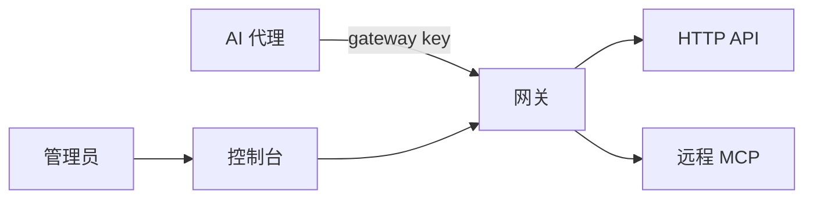

# Asterlane / 星径

[](https://github.com/komiyoo/asterlane/actions/workflows/ci.yml)

代理要接的 MCP 和 HTTP API 一多，鉴权、客户端配置、权限和上下文会一起散掉。Asterlane 把这些收进一个网关。模型调用不经过这里。

## 要解决的问题

### 各自鉴权

每个上游自带一套密钥：API key、请求头，或要由网关去换、去刷新的 OAuth token。写进每个代理的配置里，轮换一次就要改遍所有客户端，密钥也会离开管理员的控制。

```text
以前，每个客户端自己保存：
  exa    ← API key
  tavily ← API key
  github ← OAuth token

现在，客户端只保存一枚 gateway key。
网关保存上游凭据，调用时再注入；代理看不到这些密钥。
```

HTTP API 也走同一条路：网关按配置包成工具，代理仍只连接网关。

### 客户端要各配一遍

每增加一个上游，每个客户端都要再填地址和凭据。客户端应当只知道网关这一处入口。

```text
以前：
  客户端 A → Exa、Tavily、内部 API、远程 MCP
  客户端 B → 同样再配一遍

现在：
  客户端 A → 网关
  客户端 B → 网关
  上游地址和凭据只写在网关的配置里
```

### 权限分散

谁能用哪个工具若写在客户端里，就看不清，也收不回。网关按 gateway key 划定范围：允许规则放行，拒绝规则优先。一次请求里的过滤只能在这个范围里再缩小，不能看到范围外的工具。

```text
key "research":
  允许 ^search__ 和 ^reader__
  拒绝 ^search__internal__

research 调用 search__exa__neural_search  → 放行
research 调用 search__internal__lookup    → 拒绝
research 再要求「只要 exa」                → 只能少，不能多
```

换掉或吊销这枚 key，这个代理的范围就随之消失。调用记录留在网关：哪个 key、哪个工具、是否成功、花了多久。

### 大量工具撑满上下文

客户端一连接，通常会把 `tools/list` 的全部工具连同参数 schema 放进模型上下文。上游和 HTTP API 一多，任务还没开始，上下文就被目录占满。单次调用的结果过长，也会把后续回合撑满。

Asterlane 默认不把目录放进列表。`tools/list` 只返回六个固定的网关工具，目录有多大都不出现：

```text
tools/list
→ asterlane__status          这个 key 能看见多少工具
→ asterlane__search_tools    按任务搜索，先给短摘要
→ asterlane__get_tools       只为选中的名字取完整参数
→ asterlane__call_tool       调用一个
→ asterlane__call_tools      一次调用最多 10 个，各自返回
→ asterlane__fetch_result    续取被截断的长结果
```

一次任务只把用到的工具定义拿进来。搜索默认不含完整 schema；一次最多取 10 个工具的详情。

```text
asterlane__search_tools { query: "网页搜索", limit: 5 }
→ {
    tools: [
      { name: "search__exa__neural_search",
        description: "Search the web with Exa.",
        parameters: ["query"], required: ["query"] }
    ],
    next_cursor
  }

asterlane__get_tools { names: ["search__exa__neural_search"] }
→ { results: [ { tool: { name, description, input_schema } } ] }

asterlane__call_tool {
    name: "search__exa__neural_search",
    arguments: { query: "rust mcp" }
  }
→ 上游结果
```

范围外的名字搜不到，直接调用也会被拒绝。列表变短并不扩大权限。

工具的稳定全名是 `domain__provider__tool`，三段用 `__` 连接。`search__exa__neural_search` 表示 search 域、exa 这个 provider、工具 `neural_search`。配置、权限和调用记录都使用这个全名。已经知道全名时，把它交给 `asterlane__call_tool` 或 `tools/call`，搜索可以跳过。

provider 写在中间一段。要列出 exa 的全部工具，用正则对准这一段，或对准整条全名：

```text
provider_regex: ^exa$
include: ^[a-z0-9_]+__exa__
```

`^search__` 列出整个 search 域。这些过滤按名字匹配，结果按全名顺序返回。客户端把它们放进 `tools/list` 的过滤参数，只在该 key 配置了 `discovery_mode: full` 时作用到目录。默认 lazy 下，`tools/list` 仍只返回上面六个网关工具。

还不知道名字时，用 `asterlane__search_tools` 的 `query`。它在全名和描述上打分：全名完全相同优先，其次是全名以这段文字开头，然后是名字中包含，最后是描述中包含。以前缀开头的工具排在前面；名字其余部分或描述里出现同一段文字的工具也会进入结果，排在后面。网关另外配置了语义搜索时，非空查询改为按相似度排序。空查询仍按全名顺序列出这个 key 能看见的工具。

搜索结果里的 `name` 始终是三段全名。`discovery_mode: full` 的 `tools/list` 返回当前 key 下最短、且只会解析回这一个工具的名字，有时是 `neural_search` 或 `exa__neural_search`。调用时用搜索返回的全名。

全名一旦暴露就保持不变。分段、别名和过滤字段见 [命名约定](docs/architecture/naming-convention.md)。

结果超过该上游的字节预算时，网关先交回开头一段和 cursor，完整内容留在网关，用 `asterlane__fetch_result` 按段续取：

```text
call → 前一段文本
       [Result truncated. Total 200000 bytes.
        Use asterlane__fetch_result with cursor "…" to get more.]

asterlane__fetch_result { cursor: "…", offset: <已经交给模型的字节数> }
→ 下一段；后面还有时，响应里写出下一次的 offset
```

## 架构

管理员通过控制台配置上游和每个 key 的范围。代理只带着 gateway key 进入网关。网关再拿自己保存的凭据去访问上游。



## 运行机制

1. 管理员在网关里登记上游，以及每个 gateway key 能使用的范围。上游密钥留在网关。
2. 代理用这一枚 key 连接网关，按当前任务看到一部分工具。
3. 调用时，网关在这个范围内选定上游凭据，经过限额后访问对应的 MCP 或 HTTP API，再把结果交回代理。
4. 调用记录留在网关，供管理员查看和收回权限。

跑起来的命令见 [运行网关](docs/admin/running.md)。配置、权限和部署见 [文档](docs/README.md)。

## 文档

- [文档地图](docs/README.md)
- [运行网关](docs/admin/running.md)
- [贡献指南](CONTRIBUTING.md)
- [安全政策](SECURITY.md)
- [行为准则](CODE_OF_CONDUCT.md)
- [更新日志](CHANGELOG.md)

## License

[MIT](LICENSE)
