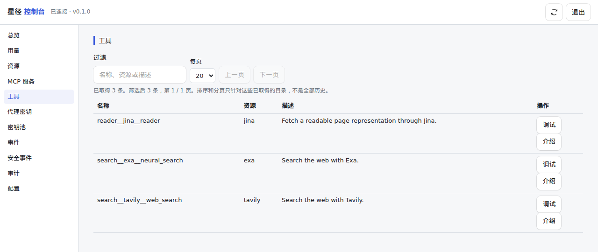

# Asterlane / 星径

[English](README.md) | 简体中文

[](https://github.com/komiyoo/asterlane/actions/workflows/ci.yml)
[](LICENSE)
[](https://www.rust-lang.org)

代理要接的 MCP 和 HTTP API 一多，鉴权、客户端配置、权限和上下文会一起散掉。Asterlane 把这些收进一个网关。模型调用不经过这里。

> [!NOTE]
> 项目处于早期开发阶段（`0.1.0`，尚未打过发布 tag）。配置字段、管理 API 和 CLI 输出在提交之间仍可能变化。破坏性变更记录在 [CHANGELOG.md](CHANGELOG.md)。

## 功能

- **凭据留在网关。** 上游 API key 和 OAuth token 从环境变量、文件、Vault 或 Infisical 取得，调用时注入。代理只持有 gateway key。
- **所有客户端只连一个入口。** 远程 MCP server（Streamable HTTP）和 HTTP API 都通过同一个 MCP 端点 `/mcp` 提供。
- **按 key 划定工具范围。** 允许和拒绝规则是作用在稳定工具名上的正则；拒绝优先，单次请求只能缩小范围。
- **默认占用很少的上下文。** `tools/list` 只返回六个网关工具；代理按任务搜索、取详情、调用。超长结果截断后分段续取。
- **HTTP API 包成工具。** 在 YAML 里声明端点，或从 OpenAPI 文档发现。
- **上游 OAuth。** 网关作为远程 MCP server 的 OAuth 客户端（client credentials 或授权码），token 加密保存。
- **限额与 key 池。** 按 key 的速率与调用配额，按上游的速率与并发上限；同一资源可配多把上游 key，支持轮换、冷却，幂等请求失败会重试。
- **可见性。** 每次调用记录 key、工具、结果和耗时，存进 SQLite；`/metrics` 提供 Prometheus 指标；另有管理控制台和 CLI。

## 快速上手

需要 Rust 1.94 及以上和 `jq`。下面使用 [`examples/gateway.yaml`](examples/gateway.yaml)。管理口令用 [`.env.schema`](.env.schema) 里的缺省值。把 `EXA_DEFAULT` 换成你自己的 key。没有有效的 Exa key 时，网关可以启动，真实搜索调用会失败。

终端 1：在 `127.0.0.1:3000` 启动网关，数据库只在内存里。

```bash
export ASTERLANE_CONFIG=examples/gateway.yaml
export ASTERLANE_ADMIN_TOKEN=demo-admin-token-2026
export EXA_DEFAULT=replace-me-exa-api-key
cargo run -- serve --database-url sqlite::memory:
```

终端 2：预览 key `agent-search-research` 能看见的工具，为它签发 gateway token，再调用一次工具。

```bash
export ASTERLANE_CONFIG=examples/gateway.yaml
export ASTERLANE_ADMIN_TOKEN=demo-admin-token-2026

cargo run -- list-tools --key agent-search-research

export ASTERLANE_KEY="$(
  cargo run --quiet -- admin proxy-keys issue agent-search-research --format json |
    jq -r '.token'
)"
cargo run -- tools call search__exa__neural_search --args '{"query":"rust mcp"}'
```

代理把 `http://127.0.0.1:3000/mcp` 当作 MCP server 接入，凭据用这枚 gateway token。更多选项见 [运行网关](docs/admin/running.md)。

## 安装

**从源码安装**

```bash
git clone https://github.com/komiyoo/asterlane.git
cd asterlane
cargo install --path . --locked
asterlane --help
```

**Docker Compose（网关 + 管理控制台）**

在仓库根执行：

```bash
docker compose up -d --build
```

网关监听 `127.0.0.1:3721`，控制台监听 `127.0.0.1:3722`。`run.yaml` 已是一份可启动的配置。用 [`.env.schema`](.env.schema) 里 `ASTERLANE_ADMIN_TOKEN` 的缺省值登录。要改口令或端口，先 export 同名变量再启动。线上部署见 [线上部署](docs/admin/deployment.md)。

**预编译二进制与镜像**

每个发布 tag 会在 [GitHub Releases](https://github.com/komiyoo/asterlane/releases) 提供 `x86_64-unknown-linux-gnu`、`aarch64-unknown-linux-gnu`、`aarch64-apple-darwin` 的二进制，并推送多架构镜像 `ghcr.io/komiyoo/asterlane`。目前还没有打过发布 tag。

## 管理控制台



控制台管理资源、MCP 服务、gateway key、key 池、用量、事件和审计日志。

## 要解决的问题

### 各自鉴权

每个上游自带一套密钥：API key、请求头，或要由网关去换、去刷新的 OAuth token。写进每个代理的配置里，轮换一次就要改遍所有客户端，密钥也会离开管理员的控制。

```text
以前，每个客户端自己保存：
  exa    ← API key
  tavily ← API key
  github ← OAuth token

现在，客户端只保存一枚 gateway key。
网关保存上游凭据，调用时再注入；代理看不到这些密钥。
```

HTTP API 也走同一条路：网关按配置包成工具，代理仍只连接网关。

### 客户端要各配一遍

每增加一个上游，每个客户端都要再填地址和凭据。客户端应当只知道网关这一处入口。

```text
以前：
  客户端 A → Exa、Tavily、内部 API、远程 MCP
  客户端 B → 同样再配一遍

现在：
  客户端 A → 网关
  客户端 B → 网关
  上游地址和凭据只写在网关的配置里
```

### 权限分散

谁能用哪个工具若写在客户端里，就看不清，也收不回。网关按 gateway key 划定范围：允许规则放行，拒绝规则优先。一次请求里的过滤只能在这个范围里再缩小，不能看到范围外的工具。

```text
key "research":
  允许 ^search__ 和 ^reader__
  拒绝 ^search__internal__

research 调用 search__exa__neural_search  → 放行
research 调用 search__internal__lookup    → 拒绝
research 再要求「只要 exa」                → 只能少，不能多
```

换掉或吊销这枚 key，这个代理的范围就随之消失。调用记录留在网关：哪个 key、哪个工具、是否成功、花了多久。

### 大量工具撑满上下文

客户端一连接，通常会把 `tools/list` 的全部工具连同参数 schema 放进模型上下文。上游和 HTTP API 一多，任务还没开始，上下文就被目录占满。单次调用的结果过长，也会把后续回合撑满。

Asterlane 默认不把目录放进列表。`tools/list` 只返回六个固定的网关工具，目录有多大都不出现：

```text
tools/list
→ asl__status    这个 key 能看见多少工具
→ asl__search    按任务搜索，先给短摘要
→ asl__describe  只为选中的名字取完整参数
→ asl__call      调用一个
→ asl__batch     一次最多 10 个独立调用；顺序只对齐结果，失败不回滚
→ asl__fetch     续取被截断的长结果
```

一次任务只把用到的工具定义拿进来。搜索默认不含完整 schema；每条带封顶描述和顶层参数签名。一次最多取 10 个工具的详情，详情里的 schema 去掉样板，类型、必填项和约束还在。

```text
asl__search { query: "网页搜索", limit: 5 }
→ {
    tools: [
      { name: "search__exa__neural_search",
        description: "Search the web with Exa.",
        signature: "query: string",
        parameters: ["query"], required: ["query"] }
    ],
    next_cursor
  }

asl__describe { names: ["search__exa__neural_search"] }
→ { results: [ { tool: { name, description, input_schema } } ] }

asl__call {
    name: "search__exa__neural_search",
    arguments: { query: "rust mcp" }
  }
→ 上游结果
```

范围外的名字搜不到，直接调用也会被拒绝。列表变短并不扩大权限。

工具的稳定全名是 `domain__provider__tool`，三段用 `__` 连接。`search__exa__neural_search` 表示 search 域、exa 这个 provider、工具 `neural_search`。配置、权限和调用记录都使用这个全名。已经知道全名时，把它交给 `asl__call` 或 `tools/call`，搜索可以跳过。

provider 写在中间一段。要列出 exa 的全部工具，用正则对准这一段，或对准整条全名：

```text
provider_regex: ^exa$
include: ^[a-z0-9_]+__exa__
```

`^search__` 列出整个 search 域。这些过滤按名字匹配，结果按全名顺序返回。客户端把它们放进 `tools/list` 的过滤参数，只在该 key 配置了 `discovery_mode: full` 时作用到目录。默认 lazy 下，`tools/list` 仍只返回上面六个网关工具。

还不知道名字时，用 `asl__search` 的 `query`。它在全名和描述上打分：全名完全相同优先，其次是全名以这段文字开头，然后是名字中包含，最后是描述中包含。以前缀开头的工具排在前面；名字其余部分或描述里出现同一段文字的工具也会进入结果，排在后面。网关另外配置了语义搜索时，非空查询改为按相似度排序。空查询仍按全名顺序列出这个 key 能看见的工具。

搜索结果里的 `name` 始终是三段全名。`discovery_mode: full` 的 `tools/list` 返回当前 key 下最短、且只会解析回这一个工具的名字，有时是 `neural_search` 或 `exa__neural_search`。调用时用搜索返回的全名。

全名一旦暴露就保持不变。分段、别名和过滤字段见 [命名约定](docs/architecture/naming-convention.md)。

结果超过该上游的字节预算时，网关先交回开头一段和 cursor，完整内容留在网关，用 `asl__fetch` 按段续取：

```text
call → 前一段文本
       [Result truncated. Total 200000 bytes.
        Use asl__fetch with cursor "…" to get more.]

asl__fetch { cursor: "…", offset: <已经交给模型的字节数> }
→ 下一段；后面还有时，响应里写出下一次的 offset
```

## 架构

管理员通过控制台配置上游和每个 key 的范围。代理只带着 gateway key 进入网关。网关再拿自己保存的凭据去访问上游。


## 运行机制

1. 管理员在网关里登记上游，以及每个 gateway key 能使用的范围。上游密钥留在网关。
2. 代理用这一枚 key 连接网关，按当前任务看到一部分工具。
3. 调用时，网关在这个范围内选定上游凭据，经过限额后访问对应的 MCP 或 HTTP API，再把结果交回代理。
4. 调用记录留在网关，供管理员查看和收回权限。

配置、权限和部署见 [文档](docs/README.md)。

## 和直连上游的对比

| | 代理直连每个上游 | 代理经过 Asterlane |
| --- | --- | --- |
| 上游凭据放在哪 | 每个客户端的配置里 | 只在网关 |
| 新增一个上游 | 每个客户端都要改 | 只改一次网关配置 |
| 谁决定工具权限 | 各个客户端 | 网关，按 gateway key 划定，可收回 |
| 连接时代理看到什么 | 每个 server 的全部工具 | 六个网关工具，其余按需取 |
| 调用记录 | 分散在各个客户端和上游 | 集中在网关，可按 key 和工具查看 |

## 不做什么

- **不是模型网关。** 不转发、不路由、不计费 LLM 推理请求。
- **不接本地 stdio MCP server。** 上游 MCP server 都是远程的，走 Streamable HTTP；网关不启动本地进程。
- **不做身份提供方。** 代理用 gateway key 认证；网关不是 OAuth 授权服务器，也不通过 SSO 登录终端用户。

## 路线图

现有缺口和优先级见 [演进规划](docs/product/roadmap.md)，使用者能看到的变化见 [更新日志](CHANGELOG.md)。

## 文档

- [文档地图](docs/README.md)
- [运行网关](docs/admin/running.md)
- [线上部署](docs/admin/deployment.md)
- [贡献指南](CONTRIBUTING.zh-CN.md)
- [安全政策](SECURITY.zh-CN.md)
- [行为准则](CODE_OF_CONDUCT.zh-CN.md)
- [更新日志](CHANGELOG.md)

## 致谢

Asterlane 基于 [rmcp](https://github.com/modelcontextprotocol/rust-sdk)（官方 Rust MCP SDK）、[axum](https://github.com/tokio-rs/axum)、[reqwest](https://github.com/seanmonstar/reqwest)、[sqlx](https://github.com/launchbadge/sqlx)、[governor](https://github.com/boinkor-net/governor) 和 [Tokio](https://tokio.rs) 构建。管理控制台使用 [React](https://react.dev) 和 Cloudflare 的 [Kumo](https://www.npmjs.com/package/@cloudflare/kumo) 组件。

## 许可证

[MIT](LICENSE)
