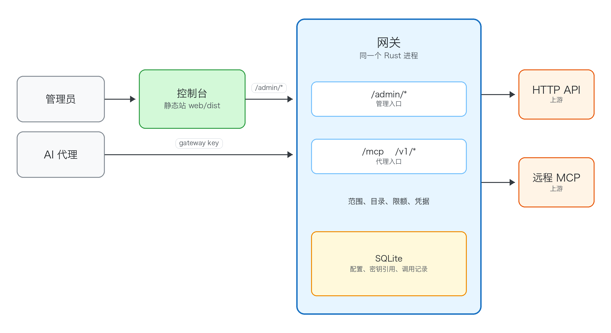

# Context

Asterlane, or 星径, centralizes third-party resource access for AI agents. The project is designed for API keys and MCP credentials, not model-provider routing.

Examples of upstream resources include Tavily, Jina, Exa, Firecrawl, internal REST APIs, and remote MCP servers. Agents receive a gateway key and a filtered catalog of usable tools rather than raw upstream credentials.

The original product requirements are preserved in [Product Requirements](../product/product-requirements.md). When architecture and implementation decisions conflict with that document, prefer the product requirements unless a newer decision document explicitly supersedes them. Significant supersessions are noted below and recorded in [Log](../log.md).

# Design Principles

- **Gateway-owned credentials**: upstream API keys and MCP auth material are referenced by secret URI and never exposed to agents. MCP 规范明确禁止 token passthrough，与本设计一致。
- **Per-key tool scope**: each proxy key has explicit `allowed_tools` and `denied_tools` regex rules. Request-level filters only narrow, never expand.
- **Stable wrapped names**: exposed MCP tools use `domain__provider__tool`（双下划线分隔，三段式），详见 [Naming Convention](naming-convention.md)。
- **Progressive disclosure**: agents list tools with regex filters, limits, and cursors instead of receiving every available tool at once.
- **Agent-native operation**: discovery and invocation are designed around how agents ask for only the resources relevant to the current task.
- **Mature crates over hand-rolled**: 协议、服务端、数据库、tracing 和基础设施能力优先使用成熟 Rust crate，选型见 [Crate Selection](crate-selection.md)。

# Significant Decisions (Supersedes Product Requirements)

| 决策 | 原始需求 | 变更后 | 依据 |
| --- | --- | --- | --- |
| MCP 工具名格式 | `domain:provider:tool:method`（冒号四段） | `domain__provider__tool`（双下划线三段） | 冒号不兼容 MCP/LLM API 字符集；`method` 段信息量为零（HTTP method 为路由细节，MCP 固定 `call`）。详见 [Naming Convention](naming-convention.md)。 |
| 控制台交付形态（2026-09-26） | 早期 vanilla UI 编译进 Rust 二进制 | 同仓库独立前端，独立构建。现有页面经 Nginx 同源访问管理 API；同源不是产品约束 | 11 个页面需要组件与类型支持；Rust 构建保持独立。页面与独立部署已在 2026-09-27 落地。线上放置见 [线上部署](../admin/deployment.md)。 |

# Module Map

运行时按职责拆分，模块边界不得塌缩。Status 列为易变状态，截至 2026-08-19；缺口全貌见 [Roadmap](../product/roadmap.md)。

| Module | Responsibility | Status |
| --- | --- | --- |
| `config` | 配置加载、schema、校验。 | 已实现 |
| `naming` | wrapped MCP tool name 解析、规范化、wire name 转换。 | 已实现（三段式） |
| `policy` | gateway key scope 与请求级收窄。 | 已实现 |
| `catalog` | 工具目录构建、过滤、分页、metadata。 | 已实现（含 MCP + OpenAPI） |
| `error` | 项目错误码与边界映射，见 [Error Model](error-model.md)。 | 已实现 |
| `secrets` | secret ref 解析与脱敏。 | env/file 默认启用；Vault/Infisical 经 `secrets.vault` / `secrets.infisical` 装配，远程路径有 TTL 缓存与瞬时重试 |
| `keys` | upstream key pool、冷却、健康、权重、registry。 | 已实现（pool + LB + 请求路径接线；admin CRUD 热更新） |
| `routing` | 负载均衡与 failover 策略。 | 已实现（集成于 keys LB） |
| `limits` | 限流、配额、队列准入。 | 已实现（GCRA + queue） |
| `proxy` | 上游 HTTP 执行。 | 已实现（retry + failover） |
| `mcp` | MCP 协议适配器与远程 MCP 代理。 | 已实现（rmcp 3.1 + `2026-07-28` 双栈） |
| `observability` | 请求事件、指标、脱敏、聚合，见 [Observability](observability.md)。 | 已实现（metrics + store + Prometheus） |
| `store` | 数据库抽象、迁移、仓库。 | 已实现（SQLite） |
| `admin` | admin API。页面在 `web/`。 | 已实现（资源/key/MCP server CRUD + Bearer 认证） |

模块编排关系：proxy 执行层编排 keys/limits/routing/secrets，不反向依赖；observability 横切所有层；catalog 是 config→MCP/HTTP 的投影层。借鉴 NyaProxy 的 TrafficManager 三合一（key 池+限流+LB）反模式，Asterlane 保持 keys/limits/routing 边界独立。

# Control Plane

控制台与网关的边界、工具链、API 类型生成和部署方式集中在 [控制台与网关分离架构](console-separation.md#系统结构)。管理 HTTP 的 Rust DTO 与 Draft 7 schema 从 `src/admin/types/` 导出。`web/` 消费 `/admin/*`，Rust 继续拥有校验、审计、持久化和工具执行，agent 数据流保持下节所述边界。

# Data Flow



管理员通过控制台配置上游和每个 key 的范围。代理只带着 gateway key 进入网关。网关再拿自己保存的凭据去访问上游。

```text
Agent
  -> Gateway proxy key (Authorization header)
  -> list_tools(include_regex, domain_regex, ..., cursor)   via _meta extension
  -> Gateway applies key scope, then request filters
  -> Agent invokes selected domain__provider__tool
  -> Gateway resolves secret ref -> injects upstream credential
  -> Upstream key pool selects key (LB strategy + health + cooldown)
  -> Rate limit / queue admission
  -> Upstream HTTP API or remote MCP server
     (for MCP, strip {domain}__{provider}__ prefix to recover upstream tool name)
  -> Gateway records RequestEvent (proxy key, upstream key ref, tool, status, latency)
  -> Response normalized, redacted, returned to agent
```

Remote MCP servers are configured under top-level `mcp_servers`, not as `api_resources` children. At startup the gateway connects to each configured server, calls upstream `tools/list`, wraps every discovered upstream tool as `{domain}__{provider}__{normalizedOriginalTool}`, preserves the original upstream tool name in catalog metadata, and merges those entries into the shared catalog used by `tools/list` and HTTP `/v1/tools`.

# Key Pool And Load Balancing

借鉴 NyaProxy（`core/control.py`、`services/lb.py`）并按 Rust 生态重新设计：

- **key 状态枚举**：`Available` / `CoolingUntil(Instant)` / `Leased{count}`，替代 NyaProxy 的伪时间戳填充冷却。
- **RAII guard**：`acquire()` 返回 guard，`Drop` 时自动 `release`，避免 NyaProxy 手工 `release_*` 四连调漏调。
- **负载均衡策略**（enum + trait）：`round_robin`、`random`、`least_requests`、`fastest_response`（EWMA 替代滑动平均数组）、`weighted`（`rand::distr::WeightedIndex`，O(log n)）。
- **冷却**：429/5xx 触发 key 冷却 `CoolingUntil(now + retry_after)`，failover 轮换到下一 key；429/503 优先采用上游 `Retry-After` 秒数。
- **per-key 凭据**：`KeyPoolRegistry`（`src/keys/registry.rs`）持 resource_id → 池 + `KeyId`→secret ref 映射；重试循环每次尝试按配置策略 acquire、解析选中 key 的 ref 后注入（配置形态见 [Configuration Schema – Key Pool](../runtime/config-schema.md)）。`AppState.key_pools` 与 `limit_registry` 同为读写锁快照；resource CRUD 热替换时按 `(resource_id, secret_ref)` 携带冷却与 EWMA，不携带 `Leased`。
- **配额退还**：整数配额（per-key `max_calls` / `max_calls_per_day`）在准入时扣减一次，同一次 invoke 内的重试不再扣减；invoke 最终失败（含准入后的 secret 解析失败）由 `CallQuotaGuard` Drop 退还。GCRA rps/rpm 不可退还（governor 无 un-consume）。并发槽由 `QueuePermit` RAII 归还。不存在独立的 endpoint / upstream-key 整数配额可退。

# Rate Limit And Queue

借鉴 NyaProxy（`services/limit.py`、`core/queue.py`）：

- **限流维度**（类型化 `LimiterKey` 枚举替代字符串拼接）：生产在用 `Endpoint(ApiId)`（上游）与 `Principal(PrincipalId)`（gateway key）；`UpstreamKey`、`Ip`、`GatewayPrincipal` 与 `RateLimits` 尚未接线（截至 2026-10-01），来历、成本与接线或保留的推荐见 [Rate Limit Dimensions](rate-limit-dimensions.md)。
- **算法**：`governor` GCRA（O(1) 内存）。整数配额可退还；GCRA 令牌不能退还。`Retry-After` 从 check 失败时的 `wait_time_from` 传递，不做非消费 peek（governor 不支持）。
- **队列**：每个配置了 `max_concurrent` 的上游一个 tokio `Semaphore` 控制并发，`tokio::time::timeout` 包裹排队；排队超时返回 503 `limit.queue_timeout`。`Priority::{MasterKey, Retry}` 已实现但生产路径固定传 `Normal`，不存在优先级队列。

# Retry And Failover

借鉴 NyaProxy（`core/queue.py:201-331`）的决策顺序，按 Asterlane 解释为：

1. 释放上游 key（RAII guard Drop）。
2. 判定可重试：**仅 `GET`** 参与状态码白名单（默认 429/500/502/503/504）、超时与连接失败重试，并受 `max_attempts` 约束。`POST` / `PUT` / `PATCH` / `DELETE` 整次 invoke 只尝试 1 次：即使 429/5xx、超时或连接失败也不重放（请求可能已到达上游）；此时 `max_attempts` 视为 1，首次失败返回既有的 `proxy.upstream_error` / `proxy.upstream_timeout` / `proxy.connection_failed`，不会变成 `proxy.retry_exhausted`。同一次 invoke 只准入一次，重试不重复扣 `max_calls`。远程 MCP `tools/call` 不走 `proxy::retry`。
3. 仅当上一步允许重试时：冷却当前 key + 抖动退避（`backon` `ExponentialBuilder`）+ failover 轮换下一 key。
4. GET 重试耗尽则 `proxy.retry_exhausted`；executor 侧未 `commit` 的 `CallQuotaGuard` Drop，退还本次准入扣下的累计/日配额。HTTP 4xx 等不可重试失败同样退还（协议层 MCP `is_error` 仍视为调用完成，不退还）。

# Credential Vault

- 配置只存 secret ref（`secret://provider/name`），不存明文。
- env 与本地文件始终可用；Vault KV v2 与 Infisical 通过顶层 `secrets` 节装配（`token_ref` 必须是 env/file 引导凭据）。远程 backend 对成功解析做进程内 TTL 缓存，并对超时 / 连接失败 / HTTP 5xx 做少次瞬时重试。云 KMS 仍为后续方向。
- 明文只在写入上游 Authorization header 的瞬间 `expose_secret`，其余时刻为 `SecretString`。
- 限流器、日志、指标中 key 以 `KeyId`（哈希/序号）索引，不以明文做键——纠正 NyaProxy 的反模式（`{api}_key_{sk-xxx}`）。

# Admin Console

管理面使用 admin key，与代理使用的 proxy key 分开。NyaProxy 把这两类密钥混用，这里不沿用。页面、管理 API 和部署见 [Admin Console](../admin/admin-console.md)。本地开发时的控制台形态见 [开发工作流 · 控制台](../engineering/development-workflow.md#控制台)。

# Roadmap

Phase 1–6（核心模型、HTTP 网关、MCP server、API 自动发现、凭据后端、analytics）的主体能力已交付。后续阶段划分、按定位支柱的缺口评估与待产品决策项见 [Roadmap](../product/roadmap.md)。

# Citations

- [1] [OKF v0.2 specification](https://github.com/GoogleCloudPlatform/open-knowledge-format/blob/main/SPEC.md)
- [2] [Product Requirements](../product/product-requirements.md)
- [3] [Naming Convention](naming-convention.md)
- [4] [Crate Selection](crate-selection.md)
- [5] [Error Model](error-model.md)
- [6] [Observability](observability.md)
- [7] [API Discovery](../runtime/api-discovery.md)
- [8] [Compatibility Policy](compatibility-policy.md)
