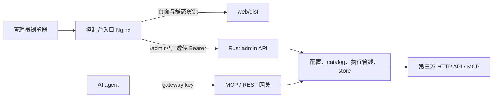
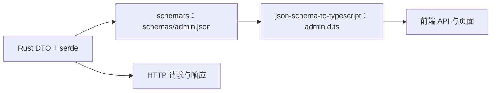

# 决策与实施状态

2026-09-26 确定目标：控制台与 Rust 网关留在同一仓库，独立构建、独立部署，经同一个控制台域名访问页面和 admin API。前端采用 React、TypeScript、Kumo 和 Vite+，Bun 作为包管理器。

本文件是已选定的架构目标，`status: stable` 不表示前端已经切换。管理请求、查询和响应 DTO 已集中在 `src/admin/types/`，`schemas/admin.json` 由 `just admin-schema` 从这些 DTO 生成，`just admin-schema-check` 只比较不覆盖。`web/src/api/generated/admin.d.ts` 由 `just api-types` 从已提交 schema 生成，`just api-types-check` 只比较。认证、11 条路由，以及总览、用量、密钥池、事件、安全事件、审计、配置七个只读页已在开发入口落地。资源、代理密钥、MCP、工具四个页面仍是待迁移占位；写操作和部署切换仍未做。当前运行时仍使用 `src/admin/ui/` 与 `include_str!`。其余实施状态以 [执行计划索引](../plans/README.md) 的待办为准。

本决策替代 [Admin Console](../admin/admin-console.md#形态决策) 中的免构建、逐文件嵌入和控制台随单二进制交付约定。页面业务范围、admin key 与 gateway key 分离、上游凭据留在网关等约束继续适用。[^console]

# 目标与边界

- 控制台承担登录引导、配置编辑、治理与观测；Rust 承担认证、校验、审计、持久化和第三方调用。
- 修改页面不触发 Rust 编译；后端的 `cargo build` 不依赖 Node、Bun、前端产物或网络安装脚本。
- 控制台只消费既有 `/admin/*`；agent 的 `/mcp`、`/v1/tools` 与管理入口保持各自的认证边界。
- 本次覆盖现有 11 个页面及已交付交互；不新增 RBAC、SSO、多租户、实时推送或网关业务功能。
- 生产交付为 Rust 网关与前端静态站两份产物。网关二进制仍可独立运行，控制台需单独部署。

# 系统结构

`Admin`、`Gateway` 和业务模块属于同一个 Rust 进程；图中拆开表示职责。前端不能直接访问 store、上游供应商或 secret backend。工具调试继续经 admin API 进入现有执行管线。

| 位置 | 职责 | 依赖方向 |
| --- | --- | --- |
| `src/admin/` | HTTP 适配、管理 DTO、鉴权与业务编排 | 依赖现有业务模块，不依赖 `web/` |
| `src/admin/types/` | 管理域请求、查询、响应 DTO；通过 `mod.rs` 导出 | 各业务域一份定义，共享结构放 `shared.rs` |
| `schemas/admin.json` | 从 Rust DTO 导出的 JSON Schema | 生成产物，纳入版本控制 |
| `web/src/api/` | 请求入口、按业务域调用函数、生成类型 | 只访问 `/admin/*`，不持有后端业务实现 |
| `web/src/app/` | 登录、路由、导航与布局 | 组合各功能模块 |
| `web/src/features/` | 页面和业务交互 | 消费 API 层与公共组件 |
| `web/src/components/` | 已有多个使用者的通用组件 | 使用 Kumo，不依赖具体业务页面 |
| `web/deploy/` | 静态服务与反向代理配置 | 不参与 Rust 构建 |

不提前建立通用 CRUD 框架、跨应用组件包或额外任务编排层。前端当前是单个应用，仓库级入口沿用 `justfile`。

# 前端工具链

| 能力 | 选择 | 使用边界 |
| --- | --- | --- |
| 页面 | React + TypeScript strict | 单页应用，组件状态与表单状态就近维护 |
| 组件 | Kumo | 使用发布包与样式入口，复用焦点、键盘与 ARIA 行为；业务组件仍需验证可访问性 |
| 路由 | React Router 声明式模式 | `BrowserRouter`，页面刷新和后退可用，不采用服务端渲染 |
| 研发工具 | Vite+ | `vp dev`、`vp check`、`vp test`、`vp build` |
| 包管理 | Bun | 固定 `packageManager` 版本，唯一锁文件为 `bun.lock`，CI 冻结安装 |
| 工具运行时 | Vite+ 管理的 Node | 不把 Bun 包管理与整套工具运行在 Bun 上混为一谈 |
| 单元与组件测试 | Vitest | 通过 Vite+ 运行 |
| 浏览器验收 | Playwright | 关键交互和真实网关回归，使用测试凭据与隔离数据 |
| 类型生成 | `schemars` + `json-schema-to-typescript` | 复用已有 Rust 依赖，新增的 JS 生成器仅用于开发 |

Vite+ 支持识别 Bun，`vp build` 使用 Vite 8 与 Rolldown；`vp check` 要明确启用 `lint.options.typeAware` 和 `typeCheck`。Kumo 与 React Router 分别承担基础组件和导航。[^vp] [^vp-install] [^vp-check] [^vp-build] [^kumo] [^router]

截至 2026-09-26，Vite+ 官方仍标注 Beta，本机 CLI 为 `1.0.0-rc.0`。实施时固定全局 CLI、项目 `vite-plus`、Node 和 Bun 的兼容版本，记录在前端 README 与锁文件；CI 不使用漂移的 `latest`。[^vp-status]

# API 契约与类型

## 单一真实源

管理请求、查询和响应 DTO 以 Rust 定义为源，采用 `serde` 和 `schemars` 派生。既有 `ResourceInput`、`ProxyKeyInput`、`McpServerInput`、签发参数与查询结构移入管理域统一入口；响应从配置与 store 显式映射，避免直接导出持久化实体。

通用协议结构若已有低层所有者，继续复用其定义；尤其错误结构保持在现有错误边界，不能让 `error` 或 `http` 反向依赖 `admin`。敏感字段不得通过 `Debug`、schema 示例或生成脚本写入日志；一次性签发响应只在其专用 DTO 中允许 token 字段。

生成器使用 JSON Schema Draft 7，按输入反序列化、输出序列化的真实语义导出；读写形状不同就使用不同 DTO，不能用手写 TS 修补差异。重点验证默认值、缺省与 `null`、枚举标记、数字和时间字段。动态工具参数与结果保留 JSON 值类型，不虚构固定业务结构。[^schemars] [^schema-ts]

`schemas/admin.json` 已提交并在文件内标记 generated。用 `just admin-schema` 重生成，用 `just admin-schema-check` 只比较不覆盖；检查失败时命令会提示 `just admin-schema`。`web/src/api/generated/admin.d.ts` 仍由后续前端计划生成。前端落地后从 `web/src/api/index.ts` 获取调用函数和类型，不在页面重复定义 HTTP 契约。schema 与 TS 各有重生成和差异检查入口；前端独立构建只需已提交产物。TS 生成接入后，契约检查同时校验 Rust → schema → TS，发现漂移即失败。

不另手写一套前端校验 schema。浏览器原生约束处理必填和格式反馈，业务合法性由后端已有校验决定；Rust 正则的合法性不能由 JS `RegExp` 的判断替代。TS 类型不被当作运行时校验或授权。

## 迁移兼容性

- 路径维持 `/admin/*`，本次不增加 `/api/v1` 前缀，不统一改成新的响应包裹格式。
- 保持当前 JSON 字段、状态码、空 body、204 和 YAML 导出的语义；新增 DTO 只替换表示，不改变业务行为。
- MCP security 写入使用嵌套 `defense: { enabled }`，读取遵守现有扁平字段；省略 auth 的更新不能误清空原凭据。
- 错误沿用 `{error: {code, message, request_id}}`，前端安全展示消息与请求 ID；网关断连导致的代理错误另显示连接失败。[^errors]
- 事件仍按时间游标加载；安全事件和审计只有当前 limit 查询能力。客户端排序、分页必须标明只覆盖已加载记录，不能声称覆盖全部历史。
- 前后端独立发布要求 API 向后兼容：先发布兼容后端，再发布使用新能力的前端；删除或改名走既有弃用策略。第一版先验证迁移前后的接口等价，不新增版本协商协议。

# 前端状态与安全

## 认证与敏感数据

管理员手输 admin token，通过 `Authorization: Bearer` 请求 `/admin/*`。沿用当前标签页内的 `sessionStorage` 语义；退出或当前会话确认收到 401 后清除 token、页面数据和在途读取。token 不进入 URL、构建变量、日志、遥测或共享查询缓存。旧会话的延迟 401 不能清掉用户刚建立的新会话。

签发得到的 gateway token 只保留在签发弹窗的临时状态；关闭、退出或组件卸载时清空，重新打开不得恢复。签发期间避免通过关闭弹窗丢失唯一返回值；网络结果不确定时提示可能已执行，禁止自动重放。复制只在用户操作后进行。

上游凭据输入继续只收 `secret://` 引用；编辑页面不能拿脱敏显示值覆盖真实引用。前端校验不能扩大服务端信任范围，后端鉴权与脱敏回归必须覆盖迁移。

## 请求与交互

- API 层使用原生 `fetch` 和 `AbortController`；取消页面读取、忽略旧查询结果，防止快速切页或切换条件后旧响应覆盖新状态。
- 修改、删除、签发、探测和工具调用由显式操作触发，进行中禁用重复提交；不因组件挂载、开发模式重复 effect 或网络失败自动重放。
- JSON 请求、204 无响应和 YAML 下载分开处理；下载的 object URL 用完释放。
- 加载、空结果和失败有不同呈现；表单失败保留输入，破坏性操作显示资源身份并二次确认，重要失败不能只靠短暂 toast。
- 使用 Kumo 的基础交互与页面内小组件；远程数据由对应页面维护，当前不引入全局状态库或通用查询缓存。
- 普通文本通过 React 文本节点呈现，工具结果用转义后的代码视图，不把上游 HTML 当页面插入。表单 label、焦点恢复、键盘操作和 reduced motion 纳入验收。

# 页面范围

业务详情以 [控制台页面地图](../admin/admin-console.md#页面地图与-api-缺口) 为准，下表只定义目标路由与模块归属。[^console]

| 页面 | 路由 | 模块 | 必须迁移的能力 |
| --- | --- | --- | --- |
| 总览 | `/` | `overview` | 健康、版本、统计、刷新与局部错误 |
| 用量 | `/usage` | `usage` | 维度、时间范围、小时趋势与统计表 |
| 资源 | `/resources` | `resources` | 列表、创建、删除、auth 与 key pool 引用输入 |
| MCP 服务 | `/mcp-servers` | `mcp` | preset、创建编辑删除、探测、详情与 security |
| 工具 | `/tools` | `tools` | 过滤、列宽调整、调试、默认参数与介绍覆盖 |
| 代理密钥 | `/proxy-keys` | `proxy-keys` | 创建编辑删除、scope、多选工具、配额、签发轮换吊销 |
| 密钥池 | `/key-pools` | `key-pools` | 脱敏池状态与刷新 |
| 事件 | `/events` | `events` | 过滤、时间游标、负载详情与存为默认参数 |
| 安全事件 | `/security-events` | `security` | 事件列表、kind 过滤与详情 |
| 审计 | `/audit` | `audit` | `admin_audit` 过滤、操作人与目标、详情 |
| 配置 | `/config` | `config` | 校验分级、YAML 下载与失败提示 |

资源 UI 当前未提供的编辑能力不因已有 PUT API 自动扩入本次范围。工具调试、默认参数和介绍编辑集中在 `features/tools/`，供工具列表、MCP 详情及事件页面组合使用。

# 构建与部署

## 开发与检查

Rust 维持根目录 Cargo 工程；`web/` 是独立前端包。`vp dev` 的 `/admin` 代理目标默认本机网关，可通过开发环境变量覆盖端口，避免 Worktree 端口冲突；生产 API 地址固定同源相对路径，不能由页面输入任意后端 URL。

仓库级 `just check` 最终汇总 Rust 检查、OKF、契约漂移检查及前端检查。纯前端命令在 `web/` 执行 `vp check`、`vp test --run`、`vp build`；端到端另有 `just web-e2e`。后端独立 Cargo 构建与测试不隐式安装 JS 依赖。具体命令在实施后同步开发与 Worktree 文档。

## 生产入口

前端采用 Nginx 静态运行镜像，构建阶段安装固定工具链并产出 `web/dist`；运行镜像只包含静态文件与服务配置。Rust 镜像沿用根 `Dockerfile`，不得读取前端目录。

控制台 Nginx 原样转发 `/admin/*` 的路径、查询参数、方法、body 与 Authorization 到配置好的网关；代理目的地由部署配置固定，浏览器不控制。普通 SPA 路由可回退 `index.html`，未知静态资源返回 404，API 的 401/404/503 等不得回退成 HTML 或缓存。

HTML 使用重新验证策略，带内容 hash 的静态资源可长期缓存；API 和一次性 token 响应不进入代理缓存。静态站补齐页面安全头，因为 Rust 的响应头不再覆盖页面。保留上版静态资源至少一个发布周期，验证页面跨版本加载和回滚，不依赖 service worker 缓存。

控制台域名由 HTTPS 入口提供服务；同源转发不要求网关开放 CORS。网关面向 agent 的 `/mcp`、`/v1/*` 继续通过其既有入口访问，不经过 SPA 回退。

## 本地组合部署

在现有 `compose.yaml` 增加 `web` 服务，通过内部网络访问 `gateway:3000`。保留网关当前的本机 3721 端口；控制台默认映射 `127.0.0.1:3722`，端口可覆盖。已有数据库卷与配置挂载保持兼容，不复制管理员凭据到前端容器或构建参数。

前端运行镜像与 Rust 镜像独立版本化，组合示例固定可复现的版本或构建输入。健康检查分别确认静态入口和 `/healthz`，静态站存活不能被当作 API 健康。迁移验证使用独立 Compose project、测试配置和数据卷，禁止动现有运行数据。

# 迁移与发布

1. 先建立 DTO/schema 和前端工程，旧内嵌 UI 仍可用；契约改造同时运行旧 API 与 CLI 回归。
2. 新前端在开发入口逐页迁移，记录页面验收。尚未迁移的入口明确显示状态，不能当作完整控制台正式切换。
3. 全部页面、关键管理操作和真实代理部署通过验收后，正式切换到静态站。迁移期只是两个页面消费者并存，管理 API 保持一套实现。
4. 同一次切换移除 `src/admin/ui/`、`console`、`ui_asset` 和 Rust 根路径到旧 UI 的重定向；`src/main.rs` 的启动提示改为 admin API 信息。
5. 新 Web 入口将历史 `/admin/ui` 和 `/admin/ui/` 精确重定向至 `/`；旧 JS/CSS 路径不做 SPA 回退。直接访问网关原始端口的旧 UI 返回 404，发布说明给出新控制台入口。

切换前保留上一版前端及网关产物。回滚使用已验证的兼容组合，不用恢复数据库或重新创建卷；如果 API 契约变更已不兼容，应先停止发布并修复兼容性，不能用页面回滚掩盖。

# 验收标准

- 干净 checkout 可分别完成 Rust 构建和前端安装、检查、测试、构建；后端构建不访问 `web/`，前端构建不启动 Cargo。
- Rust DTO、提交的 schema 和 TS 声明一致；输入默认值、可空值、204、YAML、错误 envelope 与旧响应兼容。
- 11 个页面均能直达、刷新、后退和重新认证；取消读取及延迟响应不会污染新页面或新会话。
- 创建、修改、删除、签发、轮换、吊销、探测和工具调用按现有语义执行，写操作仍有审计；浏览器测试使用本机真实网关验证关键路径。
- 无效 token 被拒绝；签发明文关闭后不留在 DOM、持久存储或页面缓存；secret 引用不被错误回填或公开。
- 真实 Nginx 入口下的 SPA 刷新、未知资源、API 错误、上传 body、YAML 下载、缓存和历史入口符合本文件约定。
- 前后端独立发布与上一版回滚验证通过后，才移除旧 UI；全程不改现有生产数据。

[^console]: [Admin Console](../admin/admin-console.md#页面地图与-api-缺口)。
[^errors]: [Error Model · HTTP 边界](error-model.md#http-边界)。
[^vp]: [Vite+ Getting Started](https://viteplus.dev/guide/)。
[^vp-install]: [Vite+ Package Management](https://viteplus.dev/guide/install)。
[^vp-check]: [Vite+ Check](https://viteplus.dev/guide/check)。
[^vp-build]: [Vite+ Build](https://viteplus.dev/guide/build)。
[^vp-status]: [Vite+ Troubleshooting](https://viteplus.dev/guide/troubleshooting)。
[^kumo]: [Kumo](https://github.com/cloudflare/kumo)。
[^router]: [React Router Declarative Installation](https://reactrouter.com/start/declarative/installation)。
[^schemars]: [SchemaSettings](https://docs.rs/schemars/latest/schemars/generate/struct.SchemaSettings.html)。
[^schema-ts]: [json-schema-to-typescript](https://github.com/bcherny/json-schema-to-typescript)。
