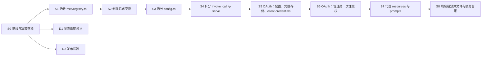

# 上游 OAuth、resources/prompts 代理、工程债与发布

决策结论见 [Roadmap · 产品决策](../../../product/roadmap.md#产品决策)。本计划只安排落点、顺序和验收。[^roadmap]

## Context

2026-10-01 定调：删除请求变换；成本核算暂缓；存储维持 SQLite；代理上游 resources 与 prompts（不做 stdio）；上游 MCP OAuth 为最高优先级产品项；偿还代码规模债；建立发布流程（每次发布 patch +0.0.1）；限流维度先出设计。

本机基线（2026-10-01，rustc 1.99.0）：`just check` 全绿，878 个测试通过、2 个 ignored。`cargo deny check` 因 rustls 0.23.43 的 RUSTSEC-2026-0285 失败，已在 S0 升级到 0.23.45。

## 执行约束

- **机器只有 2 核、3 GB 内存**：同一时刻只允许一个切片编译。所有编码切片在同一棵 worktree `.worktrees/code` 里串行执行，每个切片从最新本地 `main` 新开分支，复用该树的 `target/`。纯文档或 CI 切片（D1、D2）在各自的 worktree 中并行，不运行 cargo 编译。
- **分支与合并**：每个切片一个分支，按可审查的粒度提交（Conventional Commits，中文描述）。子代理只提交，不合并，不 push。主代理在该树复跑 `just check` 后，以 `--no-ff` 合回本地 `main`。
- **文档同步**：切片改动行为、schema 或模块边界时，同一分支内更新对应概念文档和 `docs/log.md`（新条目置顶）。CHANGELOG 在 D2 合入后建立，之后的切片在 `## [Unreleased]` 下追加条目。
- **门禁**：每个切片在自己的树里 `just check` 全绿；新增依赖时还要跑 `cargo deny check`，并更新 [Crate Selection](../../../architecture/crate-selection.md)。
- **工程纲领**：生产代码单文件 ≤500 行、单函数 ≤80 行；禁 `unwrap`/`expect`；错误有稳定码且可安全展示；`tracing` 是唯一日志通道；密钥与 token 不进日志、错误、响应和测试快照。[^conventions]

## 依赖



编码切片的箭头表示串行执行，不全是逻辑依赖。真正的逻辑依赖只有：S5 依赖 S1、S3、S4 腾出的落点；S6 依赖 S5；S8 必须最后，台账要反映最终状态。

## 切片与用户分组对照

| 切片 | 用户分组 | 分支 |
| --- | --- | --- |
| S0 | 第 0 组 | `docs/plan-2026-10` |
| S1、S3、S4、S8 | 第 2 组 | `refactor/mcp-registry-split`、`refactor/config-split`、`refactor/invoke-serve-split`、`refactor/code-budget` |
| S2 | 第 6 组 | `refactor/remove-transform` |
| S5、S6 | 第 1 组 | `feat/mcp-oauth-client-credentials`、`feat/mcp-oauth-authorize` |
| S7 | 第 3 组 | `feat/mcp-resources-prompts` |
| D1 | 第 4 组 | `docs/rate-limit-design` |
| D2 | 第 5 组 | `ci/release-setup` |

## S0 基线与决策落档

- [x] 安装 rustup（stable 1.99.0）、`just`、`cargo-deny`；`just check` 全绿。
- [x] `cargo update -p rustls`（0.23.43 → 0.23.45），修复 RUSTSEC-2026-0285，`cargo deny check` 通过。
- [x] 确认 rmcp 3.1.2 的 `auth` feature 及其边界，记入 [Crate Selection](../../../architecture/crate-selection.md)。
- [x] Roadmap 产品决策表与各阶段条目就地更新；新增本计划。

## S1 拆分 mcp/registry.rs

`src/mcp/registry.rs` 生产代码 639 行。按内聚单元拆分，纯移动、不改行为：

- [x] 上游 peer 层（`RemoteMcpPeer`、`RmcpRemoteMcpPeer`、`serve_upstream`、`PeerConnector`、`RmcpConnector`）移到 `src/mcp/peer.rs`。
- [x] transport 构造与 secret 解析（`transport_config`、`resolve_secret`）移到 `src/mcp/transport.rs`；S5 的 OAuth 接线落在这里。
- [x] 上游结果转换（`wrap_tools`、`arguments_to_object`、`convert_call_*`、`content_block_to_tool_content`）移到 `src/mcp/convert.rs`。
- [x] `registry.rs` 只保留 `McpServerRegistry`、`McpServerEntry`、`RefreshResult`；测试跟随被测代码迁移（原 20 个测试都测 registry 与健康行为，没有直接测 peer 或转换函数的用例，全部留在 `registry.rs`）。
- [x] `crate::mcp::*` 的公开路径（`McpServerRegistry`、`RemoteMcpPeer`、`RmcpRemoteMcpPeer`、`RefreshResult`）保持不变；更新 `src/mcp/mod.rs` 模块说明。`McpFuture` 路径改为 `mcp::peer`。

验收：每个文件的生产代码 ≤500 行；测试数量与拆分前一致；`just check` 全绿。

## S2 删除请求变换

- [x] 删除 `src/transform/` 与 `src/lib.rs` 的 `pub mod transform`。
- [x] 删除 `ErrorCode::TransformDangerousHeader` / `TransformInvalidPointer` 及 `transform` 分类映射，删除 `src/cli/client.rs` 中 `transform` → 退出码 8 的映射与测试。这些码从未在生产路径发出，没有消费者，不走弃用周期；在 [Error Model](../../../architecture/error-model.md) 注明退出码 8 已退役、不复用。
- [x] 同步撤回声明：[Product Requirements](../../../product/product-requirements.md)（借鉴清单、需求条目与 `Request Transformation` 节）、[Architecture](../../../architecture/architecture.md) 模块表与编排说明、[Engineering Conventions](../../../engineering/engineering-conventions.md) 分层表与 `transform` 豁免、[Development Workflow](../../../engineering/development-workflow.md) 模块表与借鉴清单、[Response Rendering](../../../runtime/response-rendering.md) 中的对照句、根 `README.md` 能力概览与项目结构、[Roadmap](../../../product/roadmap.md) 支柱四与 Phase 7 条目。
- [x] `rg -i "transform" src docs README.md` 只剩 CSS 与历史记录（`docs/log.md`、计划归档）。

验收：`just check` 全绿；全库不再有请求变换的现行承诺。

结果（2026-10-01）：删除 `src/transform/`（546 行，15 个单测）与两个 `transform.*` 错误码；退出码 8 退役，Error Model 已注明。`just check` 全绿，863 passed、2 ignored（基线 878 passed、2 ignored，差值 15 即被删模块的单测）。`src` 内 `transform` 只剩 CSS 与一条退出码退役注释；现行文档（PRD、Architecture、Engineering Conventions、Development Workflow、Response Rendering、Error Model、根 `README.md`、Roadmap）已撤回请求变换承诺，PRD 中仅由 `transform` 提供的「header/template 变量替换」条目一并移除。

## S3 拆分 config.rs

`src/config.rs` 生产代码 768 行，S5 还要在这里加 OAuth 配置。

- [x] 晋升为 `src/config/` 目录，按内聚单元拆分，例如：上游与认证类型（`ApiResource`、`UpstreamAuth`、`McpServerConfig` 等）、proxy key 与 scope、各运行时节（`secrets`、`http`、`mcp`、`observability` 等）、加载与校验（含 `expand_builtin_mcp`）。具体边界由实现者按引用关系决定。
- [x] `crate::config::X` 路径不变（`mod.rs` re-export），serde 形状与 YAML 契约完全不变。
- [x] 顺手把 `expand_builtin_mcp`（约 96 行）和 `GatewayConfig` 的 `Default` 实现（约 83 行）降到 80 行以内。实测这两处本来就在预算内（见结果），未做额外改写。

验收：每个文件的生产代码 ≤500 行；`examples/*.yaml` 加载结果不变；`just check` 全绿。

结果（2026-10-01）：`src/config.rs`（生产 768 行）拆为 `src/config/` 下 9 个文件，生产行数最大 `upstream.rs` 242、`runtime.rs` 132、`post_load.rs` 125、`mod.rs` 98，均 ≤500；`crate::config::X` 路径与 YAML 契约不变。`expand_builtin_mcp` 实测 48 行，`GatewayConfig` 是 `#[derive(Default)]`，计划里的 96 行与 83 行与代码不符，原本就在 80 行预算内，未改写。`just check` 全绿，863 passed、2 ignored（与拆分前一致）；`cargo test --lib` 758 个测试，测名清单（忽略 `config::<子模块>::tests` 路径）一致；三个 `examples/*.yaml` 的加载结果逐字节一致。

## S4 拆分 invoke_call 与 serve

- [x] `ProxyExecutor::invoke_call`（`src/proxy/executor.rs`，约 270 行）按管线阶段拆成私有步骤函数（解析与授权、准入与配额、凭据与上游调用、裁剪与事件），单函数 ≤80 行；`src/proxy/executor.rs` 生产代码 ≤500 行。
- [x] `serve`（`src/main.rs`，约 250 行）拆为装配步骤。`main.rs` 只保留 CLI 解析、装配和进程生命周期，后台任务每个 tick 收敛为某个模块公开函数的一次调用（见 [Engineering Conventions · 组合根](../../../engineering/engineering-conventions.md#组合根)）。
- [x] 消除 4 处 `#[allow(clippy::too_many_arguments)]`：`src/proxy/retry.rs` 的 `execute_with_retry`、`src/proxy/post.rs`、`src/main.rs` 的两个 refresh task 函数，聚合为参数 struct。
- [x] 行为不变：请求事件字段、错误码、tracing span 字段与拆分前一致。

验收：上述函数 ≤80 行，无 `too_many_arguments` 豁免；`just check` 全绿。

结果（2026-10-01）：`invoke_call` 拆为 `src/proxy/invoke/` 下的私有步骤（`mod.rs` 434 行、`admission.rs` 134 行，最长步骤 36 行），`executor.rs` 生产代码 624 → 269 行。`serve` 拆为 7 个装配函数（`serve` 本体 21 行），`main.rs` 生产代码 577 → 471 行；MCP refresh、描述 override 加载、基线 pin、计数回填迁入 `AppState`（`src/http/lifecycle.rs`）、`integrity`、`limits`，后台 tick 一次调用 `AppState::refresh_mcp_tools`。4 处豁免清零（`EventDraft`、`UpstreamRequest`、`AppState`）。先补 `tests/proxy_events.rs`（19 个）锁定事件、配额与 span 字段，另补 `tests/background_tasks.rs`（9 个）。`just check` 全绿，891 passed、2 ignored（S3 后基线 863 passed、2 ignored）。

## S5 OAuth：配置、凭据存储、client-credentials

目标：网关能连接需要 OAuth 的上游 MCP server。client-credentials 全自动；授权码类上游在没有已存 token 时明确显示「需要授权」（S6 补授权入口）。基于 rmcp `auth` feature，不手写 OAuth 协议。[^protocol]

配置契约（只允许用在 `mcp_servers[].auth`；用在 `api_resources` 上时启动失败）：

```yaml
mcp_servers:
  - id: linear
    url: https://mcp.example.com/mcp
    auth:
      type: oauth
      grant: client_credentials      # 或 authorization_code
      client_id: my-client           # client_credentials 必填；authorization_code 可选，缺省走 DCR
      client_secret_ref: secret://env/LINEAR_CLIENT_SECRET  # client_credentials 必填；authorization_code 可选
      scopes: [read]                 # 可选
oauth:                               # 顶层，可选；任一 server 用 authorization_code 时必填
  redirect_base_url: https://gateway.example.com   # S6 用；非 localhost 必须 https
  token_encryption_key_ref: secret://env/ASTERLANE_OAUTH_KEY  # 32 字节、base64 编码
```

- [x] `Cargo.toml` 的 rmcp 启用 `auth`；`ring`（锁文件已有 0.17）提升为直接依赖，用于 token 加密；按需直接依赖 `base64`。更新 [Crate Selection](../../../architecture/crate-selection.md)，通过 `cargo deny check`。
- [x] `UpstreamAuth` 增 `OAuth` 变体，顶层增 `oauth` 节；全部 `#[serde(default)]` 或可选，校验 fail fast（必填项缺失、`api_resources` 使用 OAuth、`redirect_base_url` 非 https 且非 localhost、密钥长度不对）。
- [x] 凭据存储：新迁移建 `upstream_oauth_credentials(server_id PRIMARY KEY, sealed_credentials, updated_at)`。rmcp `StoredCredentials` 序列化后用 `ring::aead::CHACHA20_POLY1305` 加密（随机 nonce，AAD = server id）。sqlx 访问留在 `store`，加解密放 `secrets`，rmcp 的 `CredentialStore` 适配放 `mcp`（rmcp 类型不出 `mcp/`）。无数据库时用内存存储；client-credentials 的 token 一律只放内存。
- [x] transport 接线（`src/mcp/transport.rs`）：OAuth server 用 `AuthClient<reqwest::Client>` 作为 `StreamableHttpClientTransport` 的 HTTP client；经 RFC 9728 / 8414 元数据发现取得授权服务器，RFC 8707 `resource` 用发现到的资源标识。
- [x] client-credentials：连接时 `configure_client_credentials` + `exchange_client_credentials`。rmcp 的刷新只处理 refresh token，所以 token 临近过期或被上游 401 拒绝时，必须在请求路径上重新换取，不能等周期重连。
- [x] authorization_code：启动时从存储加载已有凭据（`initialize_from_store`），由 rmcp 自动刷新；刷新后轮换的 refresh token 写回存储。没有凭据或刷新被拒绝时，server 进入新健康状态 `auth_required`。FailClosed 把它和 `unreachable` 一样视为不可用；`tools/call` 返回新错误码 `mcp.upstream_auth_required`，消息可安全展示，并提示联系管理员授权。
- [x] 测试（进程内模拟，不连真实上游）：受保护资源元数据 + 授权服务器元数据 + token 端点 + 校验 Bearer 的 Streamable HTTP MCP server。覆盖：client-credentials 握手与列工具、短 `expires_in` 后自动重新换取、存储加解密往返、密钥错误时降为 `auth_required` 并告警、无凭据的授权码 server 显示 `auth_required`、日志/错误/admin 响应中无 token 与 client secret。
- [x] 文档：[Configuration Schema](../../../runtime/config-schema.md)、[Key Credentials & Persistence](../../../runtime/key-credentials-and-persistence.md)（上游 OAuth 凭据与加密存储）、[MCP Protocol](../../../architecture/mcp-protocol.md)、[MCP Governance](../../../runtime/mcp-governance-and-key-limits.md)（`auth_required` 状态）、[Error Model](../../../architecture/error-model.md)、[Compatibility Policy](../../../architecture/compatibility-policy.md)（新配置节）、[Roadmap](../../../product/roadmap.md) 支柱一、根 `README.md`、`docs/log.md`。

验收：client-credentials 上游端到端可用，代理侧只见 gateway key；`just check` 与 `cargo deny check` 全绿。

结果（2026-10-01）：client-credentials 端到端可用（进程内模拟上游覆盖握手、列工具、调用、`resource`、短 `expires_in` 过期后在请求路径上重新换取、被 401 拒绝后重试一次、并发只换取一次）；授权码类上游有凭据时连接并刷新、轮换的 refresh token 加密写回存储，没有凭据、解密失败（密钥换了）、刷新被拒时显示 `auth_required` 并告警，FailClosed 拒绝 `tools/list`，已连接过的 server 失去授权后 `tools/call` 返回 `mcp.upstream_auth_required`。`just check` 全绿，956 passed、2 ignored（S4 后基线 891 passed、2 ignored，旧测试无删减）；`cargo deny check` 通过。新增生产文件：`src/mcp/oauth/`（`mod.rs` 233、`client_credentials.rs` 368、`credential_store.rs` 128、`resource.rs` 112、`authorization_code.rs` 85 行）、`mcp/dedup.rs` 60、`config/oauth.rs` 127、`secrets/seal.rs` 106、`store/oauth_credentials.rs` 91，均 ≤500。偏差：（1）client-credentials 没有用 `AuthClient`，而是自己包住 `reqwest::Client` 实现 `StreamableHttpClient`——`AuthClient` 对剩余不足 30 秒的 token 不发送、过期后不会重新换取，授权码上游仍用 `AuthClient<reqwest::Client>`；（2）rmcp 3.1.2 不公开发现到的 `resource`，网关按同一顺序再读一次同源的受保护资源元数据；（3）除 `ring`、`base64` 外还提升了 `async-trait`、`oauth2`（只用 `TokenResponse` trait）、`futures` 与 `sse-stream`（实现 `StreamableHttpClient` 签名所需），均已在依赖树中，锁文件只新增 `oauth2` 5.0.0 及其传递依赖；（4）从未连接成功的授权码 server 没有工具快照，其工具名不在 catalog，调用得到 `catalog.unknown_tool`，`mcp.upstream_auth_required` 只出现在曾经连接过的 server 上，状态通过健康视图发现；（5）OAuth server 的控制台编辑按钮禁用（表单不回显 client id / secret ref）。

## S6 OAuth：管理员一次性授权

目标：管理员为授权码类上游发起一次授权，之后网关自己保存并刷新 token。整个网关共用一个上游身份，不是按用户委托。

- [ ] `POST /admin/mcp-servers/{id}/oauth/authorize`（admin 认证）：元数据发现；未配置 `client_id` 时做 DCR；生成 PKCE 与 state，返回 `{authorization_url, expires_in}`。redirect URI 固定为 `{oauth.redirect_base_url}/oauth/callback`。state 只在内存保存，10 分钟过期且只能用一次。
- [ ] `GET /oauth/callback`：顶层路由，不挂 admin 认证（浏览器跳转带不了 admin token），只靠 state 校验。成功后用 code 换 token，加密存储，并触发该 server 重连（复用 probe 路径）。返回极简 HTML，不显示任何 token；失败返回可安全展示的错误页并带 `request_id`。
- [ ] `DELETE /admin/mcp-servers/{id}/oauth`：清除已存凭据，server 回到 `auth_required`。
- [ ] admin server 视图增 `oauth: {grant, status, expires_at}`，不含任何 token、client secret 或 refresh token。
- [ ] CLI：`asterlane admin mcp-servers authorize <id>`（打印授权 URL）与 `deauthorize <id>`。
- [ ] 控制台：MCP server 卡片在 `auth_required` 时显示「授权」按钮（新标签页打开 URL），已授权时显示「撤销授权」。
- [ ] 测试：模拟授权服务器（含 DCR 端点）跑完整流程（authorize → 直接以 code + state 调 callback → 连接成功）；state 错误、过期、重放均被拒；refresh 后新 refresh token 落库；admin 与 CLI 输出不含 token。
- [ ] 文档：[Admin Console](../../../admin/admin-console.md)、[CLI 架构](../../../admin/cli-client-architecture.md)、[Configuration Schema](../../../runtime/config-schema.md)、[MCP Protocol](../../../architecture/mcp-protocol.md)、[Roadmap](../../../product/roadmap.md)（Phase 8 OAuth 标已交付）、根 `README.md`、`docs/log.md`。

验收：模拟授权码上游从「需要授权」到可调用全流程走通；重启网关（SQLite 文件库）后无需重新授权；`just check` 全绿。

## S7 代理上游 resources 与 prompts

目标：在 tools 之外代理远程上游的 prompts、resources 与 resource templates。规则只有一条：可见范围沿用工具 scope。不新增配置字段。[^governance] [^compatibility]

- [ ] 命名与范围：上游 prompt 包装为 `domain__provider__<prompt>`（复用 `ToolName`；不合法的名字跳过并告警），`prompts/get` 转发时剥前缀。resource 与 template 的范围匹配名是 `domain__provider__<上游 name>`，只用于判权、不对外暴露。判权复用 `policy::key_can_use_tool` 的同一套规则（deny 优先；`allowed_tools` 正则、`allowed_servers`、`allowed_tool_names` 任一命中即允许）。为此抽出按字符串名判权的函数，`key_can_use_tool` 委托给它。开放模式（无 key）全部可见，与工具一致。
- [ ] resource URI 命名空间：对下游一律改写为 `asterlane://{server_id}/{上游原 URI}`（template 同理，变量原样保留）。`resources/read` 按前缀定位上游并还原 URI。判权时先在该 server 的 resource 快照里查 URI，查不到再按 template 字面前缀（第一个 `{` 之前）匹配；都不命中或无权限时一律返回 resource not found（-32002），不泄露存在性。
- [ ] 上游侧：扩展 `RemoteMcpPeer`（列 prompts、取 prompt、列 resources、列 templates、读 resource），带默认实现，现有测试替身不受影响。只对声明了对应 capability 的上游拉取；快照与工具同周期刷新（连接、周期 refresh、上游 `tools/list_changed`）。
- [ ] 下游侧：`AsterlaneToolServer` 开启 resources capability；`prompts/list` 合并网关自有 `asterlane_tool_workflow` 与可见的上游 prompts；实现 `prompts/get`、`resources/list`、`resources/templates/list`、`resources/read`。prompts 与 resources 列表不受 `discovery_mode` 影响。
- [ ] 治理：`prompts/get` 与 `resources/read` 经过和 `tools/call` 相同的 key 级与上游级限流准入（复用 `LimitRegistry`，不另写限流）；不计入调用配额，不写 `request_events`（在 Roadmap 登记为已知缺口）。
- [ ] 不在本轮：resource 订阅（`resources/subscribe`）、向下游推送 prompts/resources 的 list_changed、REST 与 CLI 入口。
- [ ] 测试：进程内上游同时提供 tools、prompts、resources、templates；两个 key 范围互不可见；URI 改写与还原往返；无权限读返回 -32002 且不触发上游；不支持 resources 的上游不报错。
- [ ] 文档：[Product Requirements](../../../product/product-requirements.md)（MCP 网关代理 tools/resources/prompts，stdio 为非目标）、[MCP Protocol](../../../architecture/mcp-protocol.md)（capabilities 与 URI 命名空间）、[MCP Governance](../../../runtime/mcp-governance-and-key-limits.md)（scope 规则覆盖 prompts/resources）、[API Discovery](../../../runtime/api-discovery.md)（lazy 不影响 prompts/resources）、[Compatibility Policy](../../../architecture/compatibility-policy.md)（行为变更：scope 已覆盖某上游的 key 升级后会看到其 prompts/resources；URI 命名空间格式是稳定契约）、[Roadmap](../../../product/roadmap.md) 支柱四、根 `README.md`、`docs/log.md`。

验收：MCP 客户端经网关看到并使用上游 prompts 与 resources，范围与工具一致；`just check` 全绿。

## S8 剩余超预算文件与债务台账

- [ ] 处理仍超过 500 行生产代码的文件。截至 S0 为 `src/catalog.rs`、`src/http/routes.rs`、`src/admin/crud.rs`、`src/admin/mod.rs`、`src/store/repository.rs`，另加 S5–S7 之后新超出的文件。有明显内聚单元的拆分；没有的在文件头写明拆分方向。
- [ ] 重写 [Engineering Conventions · 已知债务台账](../../../engineering/engineering-conventions.md#已知债务台账)：更正过时的 executor 行数与 `too_many_arguments` 说明；登记仍超 80 行的函数（截至 S0 例如 `handle_meta_tool_with_proxy`、`mcp::call::call_tools`、`shape_remote_mcp_result`、`mcp::server` 的 `call_tool`），写明位置与拆分方向。

验收：无未登记的超预算文件；台账与代码一致；`just check` 全绿。

## D1 限流维度设计（只出设计，不改代码）

- [x] 新建 `docs/architecture/rate-limit-dimensions.md`（`type: Design`），覆盖：生产在用的维度（`LimitRegistry` 的 `Endpoint`、`Principal`）；未接线的 `RateLimits` 与 `LimiterKey::{Ip, UpstreamKey, GatewayPrincipal}` 的原始意图、接线成本、与现有维度的重叠；每个维度给出「接线 / 保留 / 删除」选项和推荐。
- [x] `X-Forwarded-For` 信任边界列为待决项：默认不信任、可信代理 CIDR 列表、跳数等方案的取舍。多副本共享计数不在范围内。
- [x] 更新 `docs/architecture/README.md` 索引、[Roadmap](../../../product/roadmap.md) Phase 10 条目链接、`docs/log.md`。

验收：OKF 检查通过；文档足以支撑「接线或保留」的评审决定。

结果（2026-10-01）：推荐 `UpstreamKey` 接线（前提：确认有按 key 计量的上游），`RateLimits` 随之保留；`GatewayPrincipal`、`Ip` 保留不接并写明触发条件；`X-Forwarded-For` 推荐默认不信任、需要时用可信代理 CIDR。另更正 [Architecture](../../../architecture/architecture.md) 中队列与维度的过时描述。等待评审决定。

## D2 发布设置

- [x] 根目录新增 `CHANGELOG.md`（Keep a Changelog 格式），含 `## [Unreleased]`。
- [x] 新增 `docs/engineering/release-process.md`：版本策略（每次发布默认 patch +0.0.1；0.x breaking 显著标注）、发布步骤（改版本号、整理 CHANGELOG、提交、打 `vX.Y.Z` tag、由维护者 push tag）。在 [Compatibility Policy](../../../architecture/compatibility-policy.md) 的语义化版本节写入同一策略并链接过去。
- [x] `.github/workflows/release.yml`：`push` tag `v*` 触发。校验 tag 与 `Cargo.toml` 版本一致且 CHANGELOG 有对应小节；在原生 runner 上 `cargo build --release --locked` 构建 `x86_64-unknown-linux-gnu`（ubuntu-latest）、`aarch64-unknown-linux-gnu`（ubuntu-24.04-arm）、`aarch64-apple-darwin`（macos-latest），打包 tar.gz 并附 sha256；以 CHANGELOG 对应小节为说明创建 GitHub Release 并上传产物；镜像按架构在原生 runner 上构建，推送到 `ghcr.io/komiyoo/asterlane`（`X.Y.Z` 与 `latest`，linux/amd64 + linux/arm64 合成 manifest）。只用 `GITHUB_TOKEN`，权限最小化。
- [x] `ci.yml` 增 `build` job：`cargo build --release --locked`，并 `docker build`（不推送）验证 Dockerfile。
- [x] 更新根 `README.md` 的 CI 与发布说明、[Roadmap](../../../product/roadmap.md) Phase 9 发布工程条目、`docs/engineering/README.md` 索引、`docs/log.md`。
- [x] 不打 tag，不 push，不改 `Cargo.toml` 版本号。

结果（2026-10-01）：actionlint 1.7.12 + shellcheck 0.11.0 零错误；校验、说明抽取与打包脚本已用样例本机模拟。另补 `Dockerfile` 的 `--locked`；因默认 patch 发布，[Compatibility Policy](../../../architecture/compatibility-policy.md) 的弃用周期改为按发布次数计。未在 GitHub 实跑。

验收：workflow YAML 能解析（有 `actionlint` 时一并检查）；OKF 检查通过。本机无法运行 GitHub Actions，首次真实运行在维护者推 tag 时验证。

## Verification

- 每个切片：在其 worktree 跑 `just check`；新增依赖时加跑 `cargo deny check`。
- 主代理合入前在 `.worktrees/code` 复跑 `just check`，合入后在主仓跑 OKF 检查。全部切片合入后，在主仓跑一次完整 `just check` 与 `cargo deny check`。
- 不默认运行 `cargo test -- --ignored`（依赖真实上游）。

[^roadmap]: Asterlane 演进规划。
[^conventions]: 工程约定。
[^compatibility]: 后向兼容策略。
[^governance]: MCP 治理与 key 限额。
[^protocol]: MCP 协议版本与网关适配。
